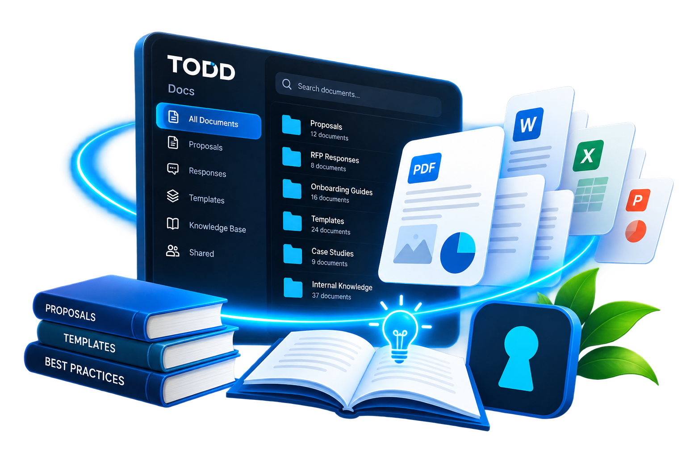

<p align="center">
  
</p>

# TODD Docs

TODD Docs is the document and knowledge workspace for Taliferro Tech. It is intended to keep proposals, RFPs, response flows, reusable answers, and supporting files close to the work they support so TODD can help find and reuse them later.

The app is an Angular 19 standalone application backed by Firebase Authentication and the Taliferro Tech API. It is configured for Firebase Hosting as the `todd-docs` site.

## What it does

The current app provides these surfaces:

- **Docs cockpit** (`/docs`) — an overview of document health, capture readiness, proposal reuse, and knowledge freshness.
- **Documents** (`/docs/documents`) — a document vault with search, carousel, desk, and pins views, plus document editing and deletion for signed-in users.
- **Add Document** (`/docs/upload`) — upload PDFs, images, video, audio, Word files, and other references with descriptive metadata.
- **Document Editor** (`/docs/editor`) — create and edit document drafts, work with `.docx` files, and export content.
- **Knowledge Base** (`/knowledge`) — browse reusable question-and-answer entries and supporting evidence.
- **Response Flow** (`/knowledge/response-flow`) — a wizard for building a reusable answer through question, response, resource, and keyword steps.
- **Proposal History** (`/docs/proposal-history`) — review uploaded RFPs and proposals generated from them.
- **RFP tools** (`/docs/rfp-upload`, `/docs/rfp-list`) — upload and browse RFP records.
- **Pricing and success pages** for Docs and Knowledge subscriptions.
- **Landing and iOS preview pages** (`/`, `/ios`) for product introduction and future mobile positioning.

## Guest mode

Most product surfaces are intentionally explorable without signing in. Guests see the layout and an honest preview, but live private values and write actions remain disabled. The browse-mode banner sends users to the hosted TODD sign-in flow, and its Home action returns to `/docs`.

Signed-in sessions resolve a tenant from the Firebase user record and attach tenant/user headers to API requests. The hosted login callback completes authentication with a Firebase custom token.

## Data and integrations

- Firebase project: `taliferrotech`
- API base URL: `https://api.taliferro.tech/api`
- Document API: `/docs`
- Response-flow API: `/response-flows`
- Hosted authentication: `https://todd.taliferro.tech/login`
- Firebase Hosting site: `todd-docs`

The frontend is a client application; authorization and tenant isolation must continue to be enforced by Firebase rules and the API. A guest request must never be treated as permission to read or write private workspace data.

## Local development

Install dependencies and start the Angular development server:

```bash
npm install
npm start
```

The development app is served at `http://localhost:4200`. Production configuration uses `src/environments/environment.prod.ts`.

Build the production bundle:

```bash
npm run build
```

The output is written to `dist/docs/browser`.

## Firebase deployment

After a successful production build, deploy the configured Hosting site with the Firebase CLI:

```bash
firebase deploy --only hosting:todd-docs
```

`firebase.json` rewrites all routes to `index.html` so Angular client-side routes work on direct navigation and refresh.

## Current limitations and intent

This project is a working Docs/Knowledge product shell and integration layer, not a complete replacement for every TODD capability. Some views are previews until a user signs in, and the quality of live results depends on the API, Firebase data, tenant configuration, subscription state, and external hosted-login flow. The iOS surface is currently a product preview rather than a native iOS application.

The codebase is also being aligned with the related Network, Pulse, Outreach, Moves, and Social products. Shared conventions—especially build versions, footer/version reporting, authentication behavior, tenant headers, and TODD visual styling—should be standardized rather than independently reimplemented in each app.
